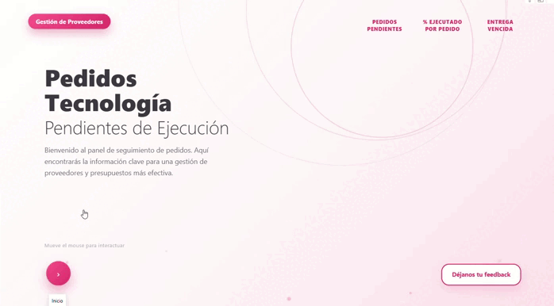
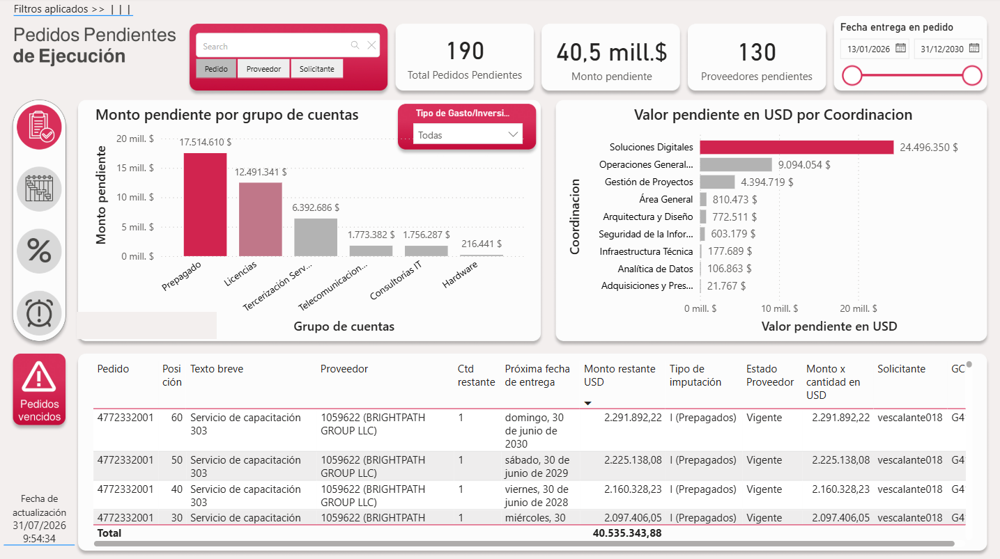
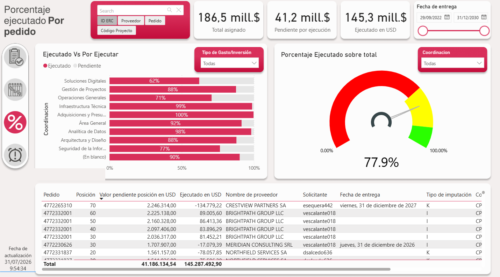
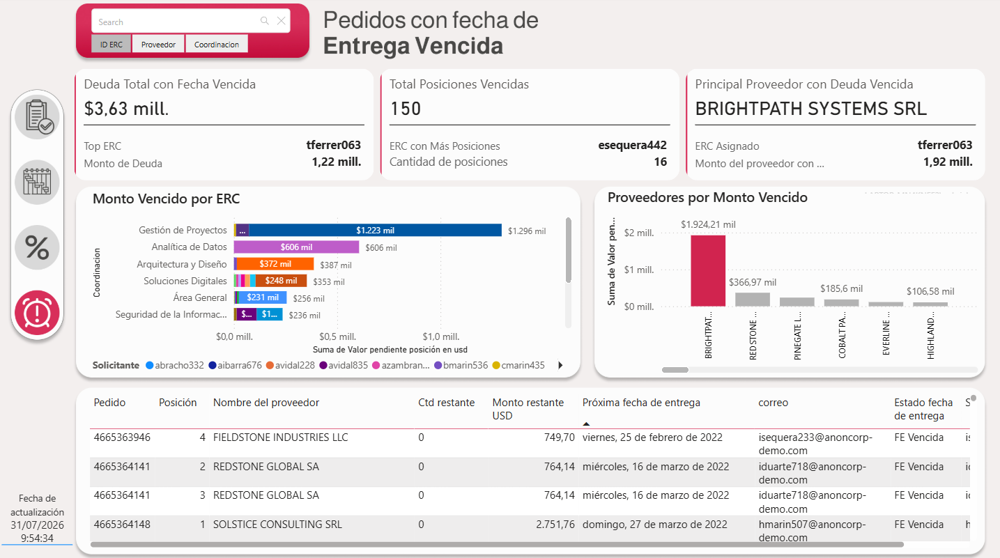

# Payment Management Tracking & Optimization Dashboard 💳📊

Dashboard construido en Microsoft Fabric / Power BI para dar seguimiento y optimización al ciclo de pagos, con alertas automáticas y filtrado multidimensional — pensado para que múltiples áreas tengan visibilidad sin necesidad de licencias SAP adicionales.

## 🧩 Qué resuelve

- Seguimiento y optimización del ciclo de pagos en tiempo real
- Alertas automáticas sobre pedidos y ejecución
- Filtrado multidimensional por ID ERC, proveedor y coordinación
- Desglose por área organizacional
- Acceso para múltiples usuarios sin licencias SAP adicionales

## 🖥️ Pestañas del tablero

| Pestaña | Qué muestra |
|---|---|
| **Portada** | Landing page con navegación y resumen |
| **Pedidos Pendientes** |  |
| **% Ejecutado por pedido** |  |
| **Entrega Vencida** |  |

## 🎥 Demo completa

[Link al video en LinkedIn / YouTube]

## 🗂️ Qué hay adentro

| Carpeta / archivo | Contenido |
|---|---|
| `docs/screenshots/` | Capturas de la portada y cada pestaña |
| `docs/media/` | GIF de demo |
| `dax/` | Las 20 medidas DAX del modelo, anonimizadas (nombres de tabla/columna genéricos, sin la marca interna) — ver `dax/README.md` |

## 🛠️ Stack

- Microsoft Fabric
- Power BI Desktop / Service
- DAX / Power Query
- *(v2 en desarrollo)* Integración directa con SAP · cambio de idioma · cambio de tema

## 🔒 Nota sobre los datos

Los proveedores, IDs ERC, números de orden y nombres de tabla/columna en este repo son ficticios o genéricos — se generaron como parte de un proceso de anonimización antes de la publicación pública. No corresponden a datos ni estructura real de ninguna organización.

## 📄 Licencia

MIT — úsalo, aprende de él, adáptalo a tu caso. Se agradece una mención, pero no es obligatorio.

---

**Gabriel Concepción** · [LinkedIn](https://www.linkedin.com/in/gabriel-concepci%C3%B3n/)
